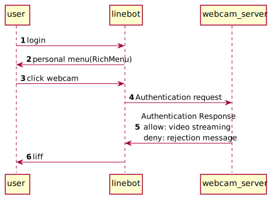
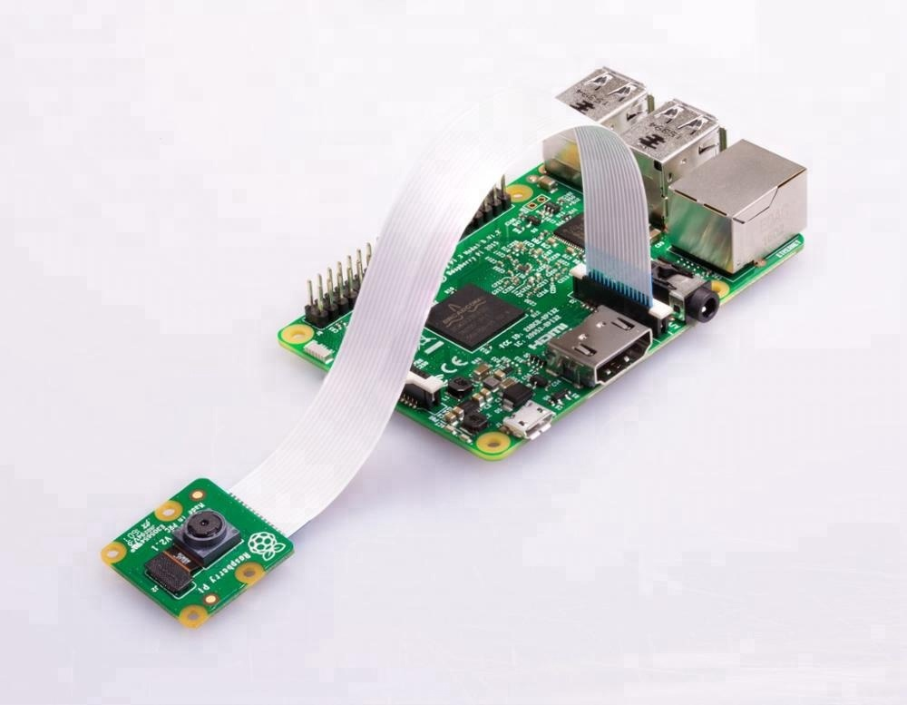

# line_webcam

## Introduction

A Iot application that combining linebot and webcam

## Sequence Diagram

## Webcam
1. Raspberry Pi
2. Camera
   

## Issue
In mobile app, user have to talk first with linebot for server get request and user id